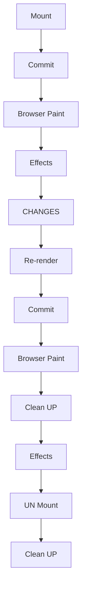

## Movie List

- Side Effects
- useEffect
- API Call
- Adding event listener

### Side Effect

Interaction between any react component and the world outside the component.
Example: Data fetching, setting timers, manually accessing DOM etc.

**CASE 1:**

```js
useEffect(fn, [x, y]);
```

Effect synchronizes with x and y.
Runs on mount and re-render triggered by updating x and y.

**CASE 2:**

```js
useEffect(fn, []);
```

Effect synchronizes with no state/props.
Runs on mount (initial render).

**CASE 3:**

```js
useEffect(fn);
```

Effect synchronizes with everything.
Runs on every render (BAD)

### Components Flow



### Clean Up

Cleanup function returns from an effect.
Runs on two occasions:

1. Before the effect is executed again.
2. After component has unmounted.

Some times the first effect still calling the APIS and another funcation also calls API. Use cleanup to solve this.

Clean up the fetch data request in the app. We are requesting data on every stroke of a key in a search bar. To restrict we can use the cleanup method. We can also cancel the previous stroked key api request.

- Each time the key stroke components get rendered or re-rendered.
- Every after each re-render cleanup function called.

```js
// clean up function
return function () {
  controller.abort();
};
```
