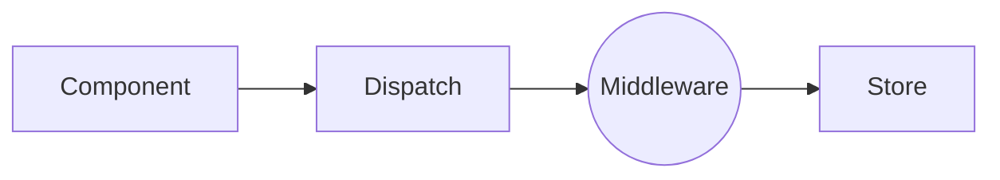
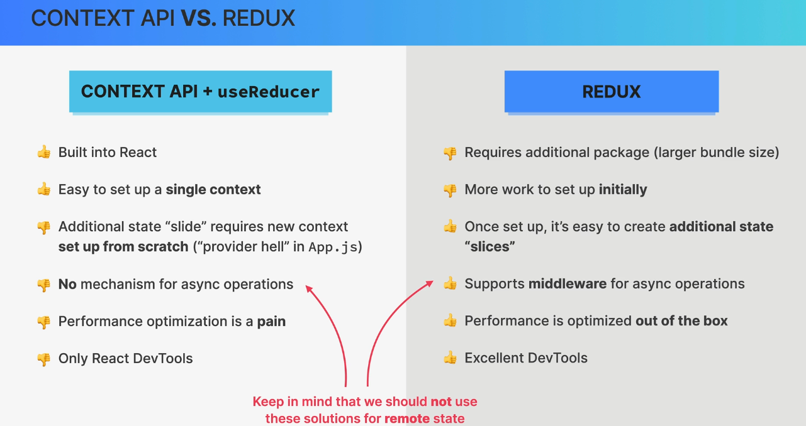
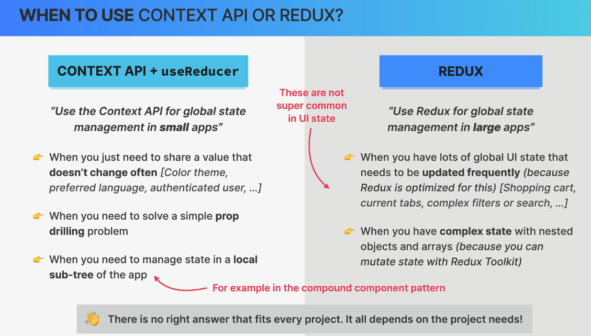
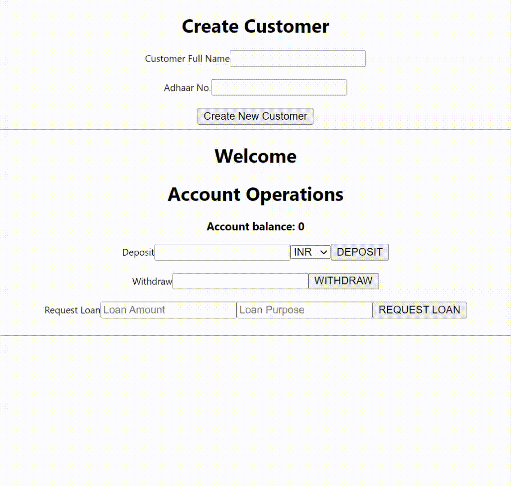

## Redux Intro

- Standalone library.
- All global state is stored in one global accessible store.

Install Redux
`npm install redux react-redux`

### Redux Middleware - Thunks

- We cannot make a asynchronous calls inside Redux store.
- Redux are pure functions.
- Async calls shall happen outside the Redux store.
- To make async call use middleware.

Middleware are perfect for

1. API Calls
2. Timers
3. Logging
4. Other side effects

Popular middleware is Redux-Thunk.

### Thunk

Installing Thunk
`npm i redux-thunk`

### Dev Tools

Install Chrome `Redux DevTools`

Install NPM package
`npm i @redux-devtools/extension`

### Redux Tool Kit

- Modern way of writing redux code.
- Forces us to use redux best practices.
- Less boilerplate.

#### Best about Redux Tool Kit

1. Allow us to **mutate** state inside reducers.(Will be converted to immutable by Immer Library)
2. Action creators are autmatically created.
3. Automatically setup of thunk middleware and dev tools.

Installation:
`npm i @reduxjs/toolkit`

### Redux vs React Context API

### When to use Context API and Redux

### DEMO

