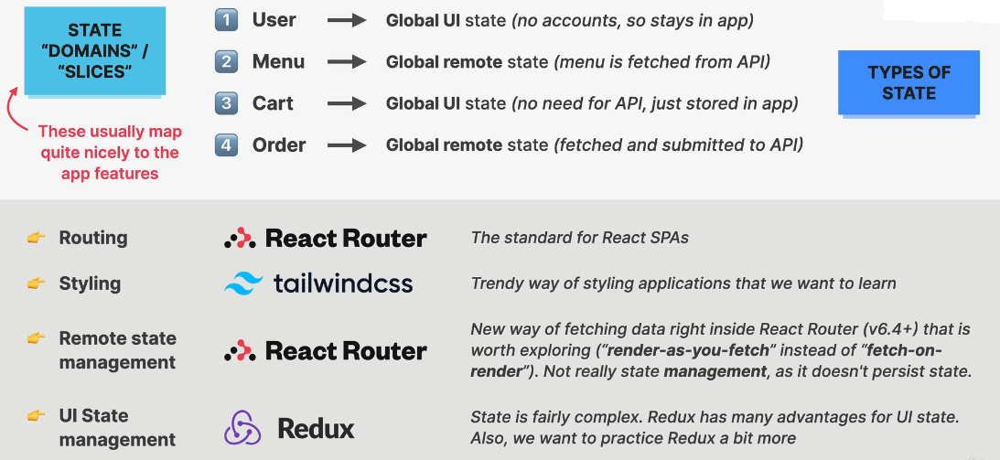

## Pizza App - Professional Project

### Installation via Vite

Create Project

`npm create vite@4`

or

`npm create vite@latest`

```shell
 cd project_name
 npm install
 npm run dev
```

Install ESLINT

```shell
npm i eslint vite-plugin-eslint eslint-config-react-app --save-dev
```

Configure Eslint

Create file in root dir

`.eslintrc.json`

```json
{
  "extends": "react-app"
}
```

Update file

`vite.config.js`

```js
import { defineConfig } from "vite";
import react from "@vitejs/plugin-react";
import eslint from "vite-plugin-eslint";

// https://vitejs.dev/config/
export default defineConfig({
  plugins: [react(), eslint()],
});
```

### Planning

1. Gather application requirements and features.
2. Divide application into pages.
3. Divide the application into feature categories.
4. Decide on what libraries to use. (technology decision)

### 1. Requirements


### 2. Features and Pages


### 3. State Management and Technology Decisions



### Setting Professional File Structure

Feature based structure

```
src/
├── features/
│   ├── user
│   ├── menu
│   ├── cart
│   └── order
├── ui
├── services
└── utils
```

### React Router

Install
`npm i react-router-dom`

### Hooks Summary

1. `useLoaderData()`: This hook provides the value returned from your route loader.
2. `useNavigation()`: useNavigation is a hook which gives access to navigation object. It's useful when you cannot pass the navigation prop into the component directly, or don't want to pass it in case of a deeply nested child.

```json
formAction: undefined
formData: undefined
formEncType: undefined
formMethod: undefined
json: undefined
location: undefined
state: "idle"
text: undefined
```

3. `useNavigate()`: The useNavigate hook returns a function that lets you navigate programmatically.
4. `useRouteError()`: Inside of an errorElement, this hook returns anything thrown during an action, loader, or rendering.
5. `useParams()`: The useParams hook returns an object of key/value pairs of the dynamic params from the current URL.
6. `useActionData()`: Returns the serialized data from the most recent route action.

## Tailwind CSS

- Install Tailwind from website.
- Install VS code package: headwind, tailwind.

## Redux - STEP BY STEP GUIDE

Install
`npm i @reduxjs/toolkit react-redux`

### STEP 01: Create Store.

`src/store.js`

```js
import { configureStore } from "@reduxjs/toolkit";

import userReducer from "./features/user/userSlice";

const store = configureStore({
  reducer: {
    user: userReducer,
  },
});

export default store;
```

### STEP 02: Provide global state to entire app.

`main.jsx`

```js
ReactDOM.createRoot(document.getElementById("root")).render(
  <React.StrictMode>
    <Provider store={store}>
      <App />
    </Provider>
  </React.StrictMode>
);
```

### STEP 03: Create user slice or state.

`src > features > user > userSlice.js`

```js
import { createSlice } from "@reduxjs/toolkit";

const initialState = {
  username: "",
};

const userSlice = createSlice({
  // name of state -> user
  // property -> username
  name: "user",
  initialState,
  reducers: {
    updateName(state, action) {
      state.username = action.payload;
    },
  },
});

export const { updateName } = userSlice.actions;

export default userSlice.reducer;
```

### STEP 04: Getting state data

```js
import { useSelector } from "react-redux";
// getting state by -- state.nameState.property
const username = useSelector((state) => state.user.username);
```

### STEP 05: Setting state data

```js
const dispath = useDispatch();
dispath(updateName(username));
```
