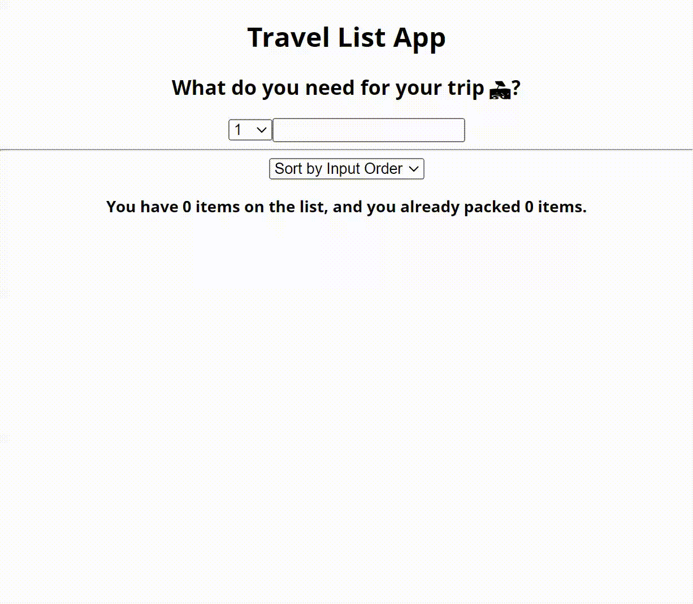

## Travel List

- Forms
- Lifting up states
- Child to parent communication
- Derived state
- Children prop

### Children prop

The children prop is passed to the function with the text or element in between.
Example

```js
export default function TabButton({ children }) {
  return (
    <div>
      <button>{children}</button>
    </div>
  );
}
```

```html
<TabButton>React</TabButton>
```


## Demo

