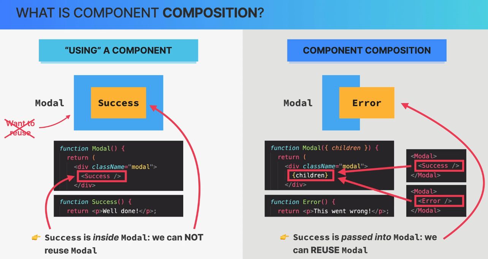

## Usepopcorn App

### When to create a new component

1. Always start with a big component and slowly split into small component when it become necessary.
2. Dont focus on reusibility and complexity at the very beginning.
3. Component which doesnot belong to each other we can separate it.
4. Feel productive using components.

### Component Guidelines

1. Name a component according to what it does and dont be afraid of having long names.
2. Never declare a component inside another component, do co-locate the components inside the same file.
3. Smaller the component more the re-usability.

### Components Category

1. Stateless Components: Dont have any state. Only presentation.
2. Statefull Components: Have state.
3. Structural Components: Used to only show the html structures.

### Composition

### Star Rating App

