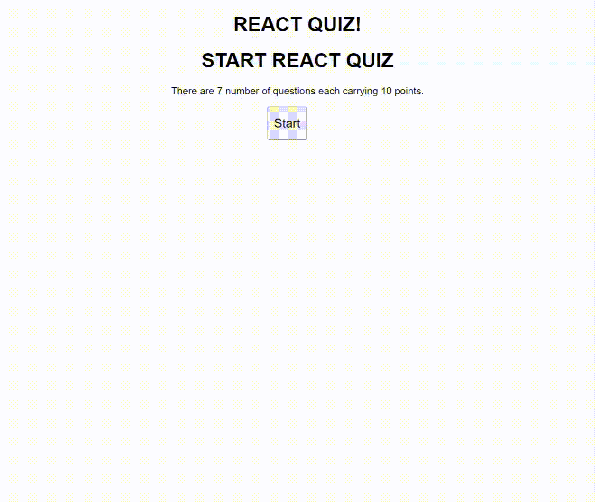

# Quiz App

- reducer impl.
- timer impl.

### Install fake json server to fake API request

`npm i json-server`

To watch the data file, add under package.json file
`"server": "json-server --watch data/questions.json --port 8000"`
`npm run server`

### Demo

