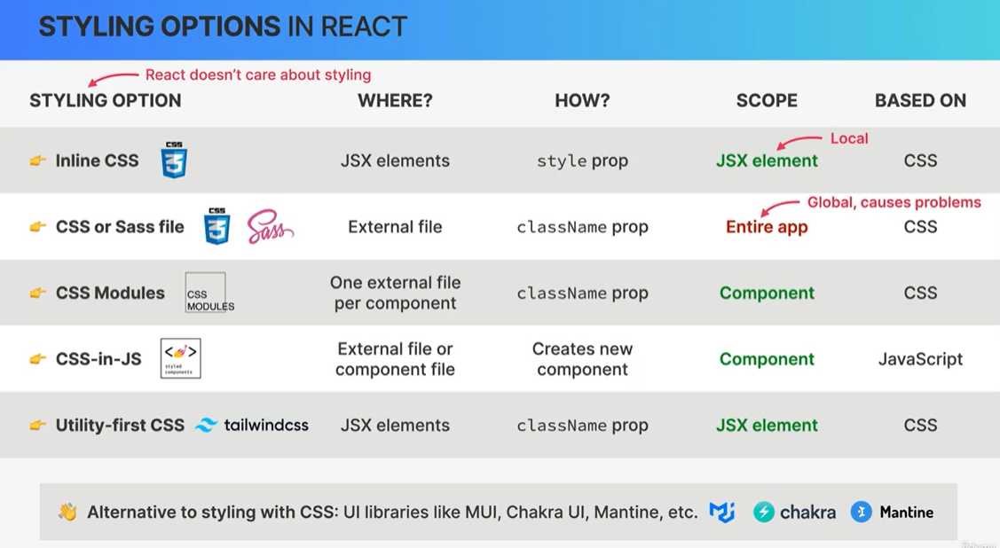
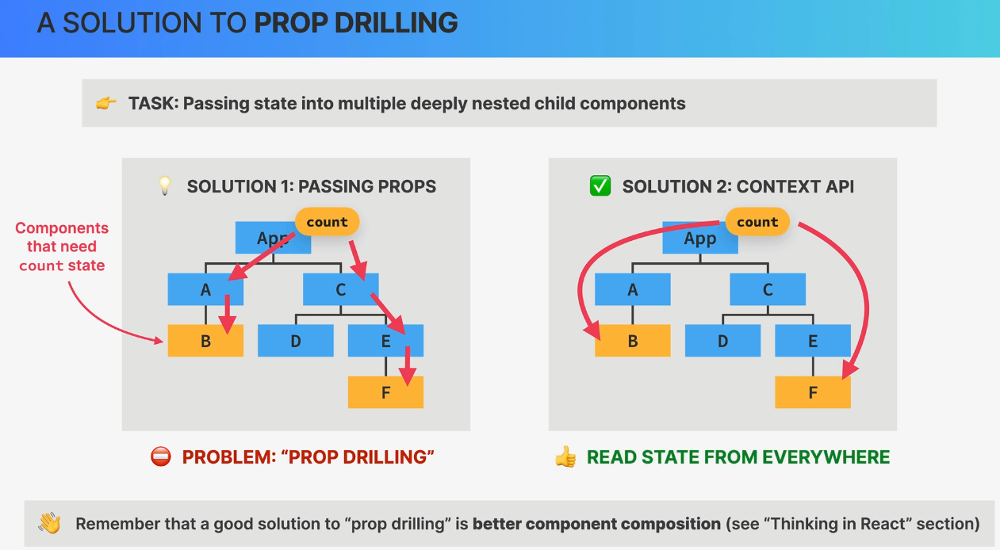
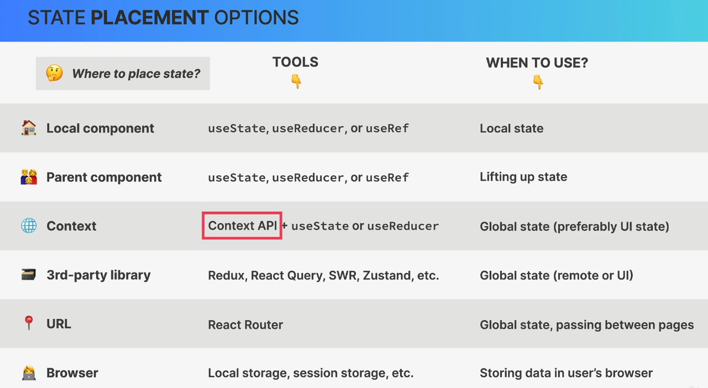
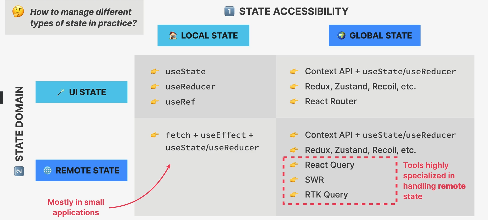

## World Wise App

#### Features

- React Router
- Nested Routes
- CSS Modules
- State Management using URL (Dynamic Routing)
- Context API
- Leaflet Map Library
- Date Picker

#### Installation via Vite

```bash
npm create vite@4 > React > JavaScript
npm install
npm run dev
```

#### Configuring ESLINT

STEP 01:
Install
`npm install eslint vite-plugin-eslint eslint-config-react-app --save-dev`

STEP 02:
`eslintrc.json`

```
{
    "extends": "react-app"
}
```

STEP 03:
`vite.config.js`

```js
...
import eslint from "vite-plugin-eslint"

// https://vitejs.dev/config/
export default defineConfig({
  plugins: [react(), eslint()],
})
```

#### React Router

Installation
`npm i react-router-dom@6`

#### Styling React Component



#### Json Server for Fake API Call

```shell
# Install json server
npm i json-server

# under package.json > scripts, add
"server": "json-server --watch data/cities.json --port 8000 --delay 500"

# run server
npm run server
```

#### State Management Using URL

- URL is excellent place to store UI State and an alternative to useState in some situations.
- Good way to pass data, globally and one page to another.
- Possible to bookmark page. eg. filtering pages.
- We can achieve this using `params` and `query string`.

### Context API

Context provides a way to pass data through the component tree without having to pass props down manually at every level.



Provider: Give all child component access to value.
value: This is the data which we want to make available.
Consumers: All components can read data with it. (Consumer will get updated and re-render the component)

**STEP 01: Create Context**

```js
const PostContext = createContext();
```

**STEP 02: Provide value to child**

```js
<PostContext.Provider value={{ posts: searchedPost, onAddPost: handlePost }}>
  <Header />
</PostContext.Provider>
```

**STEP 03: Consuming context value**

```js
function Header() {
  // consuming only those which are neccessary.
  const { posts } = useContext(PostContext);
}
```

### Advanced Pattern for Using Context API

Create Separate component for state related operations. Also we can add button click or any other event here.
`PostContext.js`

```js
// STEP 01
const PostContext = createContext();

// STEP 02
function PostProvider({children}){
  // all state related calls and functions goes here.
  ...
  ...
  return (<PostContext.Provider value={{ posts: searchedPost, onAddPost: handlePost }}>{children}</PostContext.Provider>);
}

// custom hooks
function usePosts(){
  const context = useContext(PostContext);
  if(context === undefined){
    throw new Error("PostContext was used outside the PostProvider");
  }
  return context;
}

export {PostProvider, usePosts};
```

Wrap with PostProvider

```js
<PostProvider>
  <Header />
</PostProvider>
```

```js
// STEP 03
function Header() {
  // consuming only those which are neccessary.
  const { posts } = usePosts();
}
```

### State Placement Options



### State Management Options



### Leaflet for Map Integration

Installation
`npm i react-leaflet leaflet`
