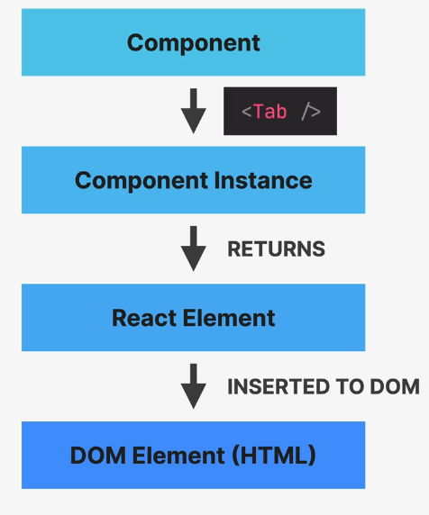

# React


## Important Points

#### We should always update the state based on current state.

Don't update like this :x:

```js
setState(step +  1);
```

Use callback like this :white_check_mark:

```js
setState((currentStepValue)  => currentStepValue +  1);
```

## Fundamental

### First react application

Components, `useState`, `useEffect`, `fetch`, API call

```js
import { useEffect, useState } from "react";

export default function App() {
  // useState return array, thorugh which state can be
  // set and fetched.
  const [advice, setAdvice] = useState("");
  const [count, setCount] = useState(0);

  async function getAdvice() {
    const res = await fetch("https://api.adviceslip.com/advice");
    const data = await res.json();
    setAdvice(data.slip.advice);
    setCount((c) => c + 1);
  }

  // Gets first getAdvice initially
  useEffect(function () {
    getAdvice();
  }, []);

  return (
    <div>
      <h1>{advice}</h1>
      <button onClick={getAdvice}> Get Advice </button>
      <Message count={count} />
    </div>
  );
}

function Message(props) {
  return (
    <div>
      <p>You have fetched {props.count} of advices.</p>
    </div>
  );
}
```

### VC code packages

- ESLint

- Prettier - Code formatter

- Material Icon Theme
  
  ### Create app - three ways
  
  - create-react-app - don't use for real world apps.
  
  - vite
  
  - using framework like next.js
    
    ### create-react-app
    
    `npx create-react-app my-app`
  
  ### React basic flow
  
  `index.js`
  
  ```js
  import React from "react";
  import ReactDOM from "react-dom/client";
  ```

function App() {
  return <h1>Hello React!</h1>;
}

// React.StrictMode will run the script twice to check if any bug exists.
const root = ReactDOM.createRoot(document.getElementById("root"));
root.render(
  <React.StrictMode>
    <App />
  </React.StrictMode>
);

```
`index.html`
```html
<div  id="root"></div>
```

### JSX

1. Extension of JavaScript which uses combination of JavaScript, CSS and HTML.
2. Babel is used to covert JSX to JavaScript.
3. Statements are not allowed in JSX.
4. JSX is declarative.
5. Imperative: Just like in JS we get the element from HTML and do what we want to do. For buttons we add listeners and ask listeners to listen to button click. This process is called as Imperative approach. **"How to do things"**
6. Declarative: Based on current state. No listeners, no HTML properties usage. It is like a abstraction. **"What we want to do"**

### Props

- Immutable and can only be read.
- If we want to mutate props use state.
- Data can only be passed from parent to child using props.

### Developer Tools

Chrome Dev Tools

## State, Events and Forms

### Children prop

The children prop is passed to the function with the text or element in between.
Example

```js
export default function TabButton({ children }) {
  return (
    <div>
      <button>{children}</button>
    </div>
  );
}
```

## How React Works? (INCOMPLETE)

### Component vs Instance vs Element

### Component and Instance

1. Instances are created whenever we use components.

        eg. `<App />`

2. React internally calls `App()`

3. Has a lifecycle can be born, live and die.

4. Has its own state and props.




## 
